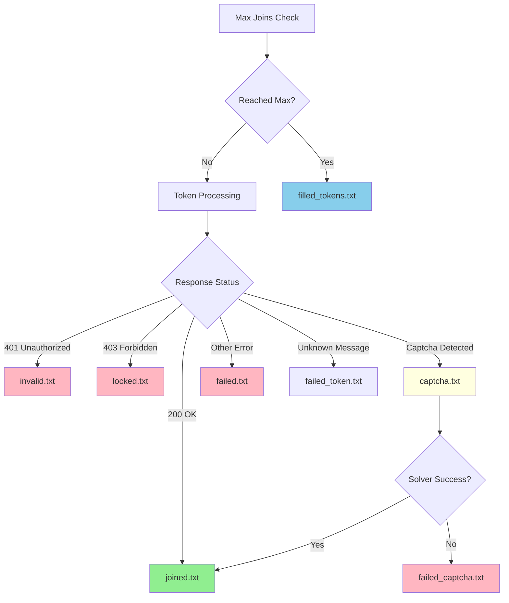

## Output Directory

All output files are saved to the `output/` directory. The tool creates this directory automatically if it doesn't exist.

## File Writing Mechanism

Output files are written using the `_append_to_file` method (from `index.py:134-136`):

```python
def _append_to_file(self, filename: str, content: str):
    with open(f"output/{filename}", "a") as f:
        f.write(f"{content}\n")
```

Each token is written on a new line, making it easy to parse and reuse the files.

## Output Files Reference

### joined.txt

**Purpose**: Contains tokens that successfully joined the server

**Triggered by**: HTTP 200 response from Discord API

**Source code**: `index.py:145-149`

```python
if response.status_code == 200:
    NovaLogger.win("Successfully Joined Server", token=masked_token, thread=self.thread_number)
    self._append_to_file("joined.txt", token)
    self.stats.joined += 1
    return
```

**Example content**:
```
MTE1NDU2Nzg5MDEyMzQ1Njc4OQ.AbCdEf.GhIjKlMnOpQrStUvWxYz
ODk4NzY1NDMyMTA5ODc2NTQzMg.XyZwVu.TsRqPoNmLkJiHgFeDcBa
MTIzNDU2Nzg5MDEyMzQ1Njc4OQ.QwErTy.UiOpAsDfGhJkLzXcVbNm
```

### invalid.txt

**Purpose**: Stores tokens that are invalid or unauthorized

**Triggered by**: HTTP 401 (Unauthorized) response

**Source code**: `index.py:151-156`

```python
if response.status_code == 401:
    NovaLogger.fail("Invalid Token", token=masked_token, thread=self.thread_number)
    self._append_to_file("invalid.txt", token)
    token_manager.remove_token(token)
    self.stats.invalid += 1
    return
```

**Important**: These tokens are automatically removed from `input/tokens.txt` to prevent reuse.

### locked.txt

**Purpose**: Contains tokens that are locked or restricted by Discord

**Triggered by**: HTTP 403 (Forbidden) response

**Source code**: `index.py:158-163`

```python
if response.status_code == 403:
    NovaLogger.fail("Locked Token", token=masked_token, thread=self.thread_number)
    self._append_to_file("locked.txt", token)
    token_manager.remove_token(token)
    self.stats.locked += 1
    return
```

**Important**: These tokens are also automatically removed from `input/tokens.txt`.

### captcha.txt

**Purpose**: Logs all tokens that encountered a captcha challenge

**Triggered by**: Response containing "captcha_sitekey" when captcha solving is enabled

**Source code**: `index.py:189-192`

```python
if "captcha_sitekey" in response.text and self.config.captcha["solve_captcha"]:
    NovaLogger.alert("Captcha Detected", token=masked_token)
    self._append_to_file("captcha.txt", token)
    self.stats.captcha += 1
```

**Note**: This file contains ALL tokens that hit captcha, regardless of whether the captcha was successfully solved.

### failed_captcha.txt

**Purpose**: Stores tokens where captcha solving failed

**Triggered by**: Response containing "captcha_key" error after solver attempt

**Source code**: `index.py:171-175`

```python
if "captcha_key" in response.text:
    NovaLogger.fail("Failed Due To Solver Issue", token=masked_token, error=response.json()['captcha_key'], thread=self.thread_number)
    self._append_to_file("failed_captcha.txt", token)
    self.stats.failed += 1
    return
```

**Reason**: The captcha solver returned an invalid or rejected solution.

### failed.txt

**Purpose**: General failure file for tokens that failed for other reasons

**Triggered by**: Any error not covered by the specific categories above

**Source code**: `index.py:177-179`

```python
NovaLogger.fail(f"Failed To Join Server", token=masked_token, error=response.text, thread=self.thread_number)
self._append_to_file("failed.txt", token)
self.stats.failed += 1
```

**Common causes**:
- Network errors
- Unexpected API responses
- Server-side issues
- Unknown error messages

### filled_tokens.txt

**Purpose**: Contains tokens that have reached the maximum number of joins configured in `config.json`

**Triggered by**: Token join count >= `max_joins` setting

**Source code**: `index.py:269-272`

```python
joins = token_manager.increment_joins(token)

if joins >= config.max_joins:
    with open("output/filled_tokens.txt", "a") as f:
        f.write(f"{token}\n")
    continue
```

**Note**: These tokens are NOT removed from `input/tokens.txt` but are skipped for remaining invites.

## File Relationship Diagram



## Token Removal Behavior

Only **invalid.txt** and **locked.txt** tokens are automatically removed from `input/tokens.txt`:

```python
token_manager.remove_token(token)
```

This prevents permanently unusable tokens from being retried in future runs.

<Accordion title="What if a file already exists from a previous run?">
  The tool uses append mode ("a"), so new results are added to the end of existing files. If you want fresh results, manually delete files in the `output/` directory before running.
</Accordion>

<Accordion title="Can I use these output files as input?">
  Yes! For example, you can copy `joined.txt` to `input/tokens.txt` to run another batch of joins with only successful tokens. The format is identical.
</Accordion>

<Accordion title="Why is my token in both captcha.txt and joined.txt?">
  This is normal. `captcha.txt` logs when a captcha is encountered, but if the solver succeeds, the token still joins successfully and gets written to `joined.txt` as well.
</Accordion>

<Accordion title="What's the difference between failed.txt and failed_captcha.txt?">
  - `failed_captcha.txt`: Captcha was encountered but the solver provided an invalid solution
  - `failed.txt`: Generic failures like network errors, rate limits, or unexpected API responses
</Accordion>