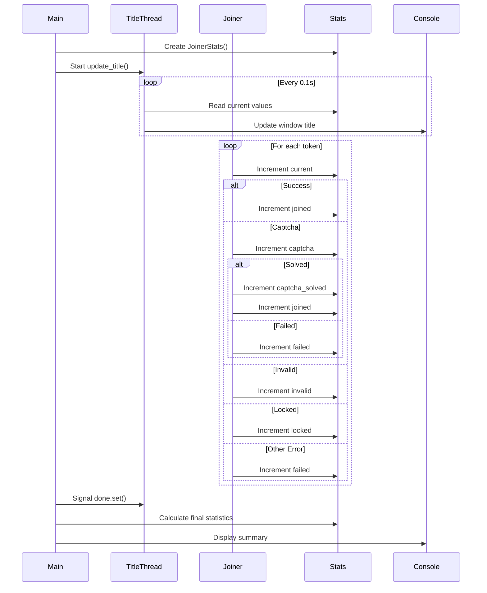

## Statistics Data Structure

The tool tracks statistics using the `JoinerStats` dataclass (from `index.py:40-49`):

```python
@dataclass
class JoinerStats:
    total: int = 0
    joined: int = 0
    captcha: int = 0
    captcha_solved: int = 0
    failed: int = 0
    locked: int = 0
    invalid: int = 0
    current: int = 0
```

### Field Descriptions

| Field | Description | Incremented When |
|-------|-------------|------------------|
| `total` | Total number of invites to process | Initially set to invite count |
| `joined` | Successfully joined servers | HTTP 200 response received |
| `captcha` | Captcha challenges encountered | "captcha_sitekey" detected in response |
| `captcha_solved` | Captchas successfully solved | Solver returns valid solution |
| `failed` | Failed join attempts | Generic errors or captcha solver failures |
| `locked` | Locked/restricted tokens | HTTP 403 response received |
| `invalid` | Invalid/unauthorized tokens | HTTP 401 response received |
| `current` | Current number processed | Each response handled |

## Real-Time Console Title

The console window title updates continuously to show live statistics during execution.

### Title Format

From `index.py:223-239`, the title is updated by a dedicated thread:

```python
def update_title(stats: JoinerStats, done: threading.Event, total_invites: int):
    """Updates the console title with current joining statistics."""
    while not done.is_set():
        try:
            ctypes.windll.kernel32.SetConsoleTitleW(
                f"Filly | "
                f"Total: {total_invites} | "
                f"Joined: {stats.joined} | "
                f"Failed: {stats.failed} | "
                f"Captcha: {stats.captcha} ({stats.captcha_solved} solved) | "
                f"Invalid: {stats.invalid} | "
                f"Locked: {stats.locked}"
            )
            time.sleep(0.1)
        except Exception as e:
            NovaLogger.fail(f"Title Update Error: {str(e)}")
            break
```

### Example Title

```plaintext
Filly | Total: 50 | Joined: 23 | Failed: 2 | Captcha: 5 (3 solved) | Invalid: 1 | Locked: 0
```

### Update Frequency

The title refreshes every **100 milliseconds** (0.1 seconds) for smooth real-time updates.

### Thread Behavior

- Runs as a **daemon thread** - automatically exits with main program
- Uses a **threading.Event** signal to stop gracefully
- Handles errors to prevent crashes during title updates

## Final Statistics Display

When the joining process completes, a comprehensive statistics summary is displayed.

### Output Format

From `index.py:286-301`, the final statistics appear as:

```python
elapsed = time.time() - start_time
minutes, seconds = divmod(int(elapsed), 60)

sep_line = "=" * 50
print(f"\n{sep_line}")
print(f"{Fore.CYAN}Final Statistics:{Style.RESET_ALL}")
print(f"Joined {stats.current} Tokens in {minutes} Minutes and {seconds} Seconds")
print("\nSummary:")
print(f"- Total Processed: {Fore.CYAN}{stats.current}{Style.RESET_ALL}")
print(f"- Successfully Joined: {Fore.GREEN}{stats.joined}{Style.RESET_ALL}")
print(f"- Captcha Encountered: {Fore.YELLOW}{stats.captcha} {Fore.CYAN}({stats.captcha_solved} solved){Style.RESET_ALL}")
print(f"- Failed: {Fore.RED}{stats.failed}{Style.RESET_ALL}")
print(f"- Invalid Tokens: {Fore.RED}{stats.invalid}{Style.RESET_ALL}")
print(f"- Locked Tokens: {Fore.RED}{stats.locked}{Style.RESET_ALL}")
print(f"\n{sep_line}")
```

### Example Output

```plaintext
==================================================
Final Statistics:
Joined 47 Tokens in 2 Minutes and 34 Seconds

Summary:
- Total Processed: 47
- Successfully Joined: 40
- Captcha Encountered: 8 (6 solved)
- Failed: 2
- Invalid Tokens: 3
- Locked Tokens: 2

==================================================
Press Enter to exit...
```

### Color Coding

- **Cyan** - Informational (Total Processed, Captcha count)
- **Green** - Success metrics (Successfully Joined)
- **Yellow** - Warnings (Captcha Encountered)
- **Red** - Errors (Failed, Invalid, Locked)

## Statistics Tracking Flow



## Time Calculation

The tool tracks execution time from start to finish:

```python
start_time = time.time()  # Before joining starts

# ... joining process ...

elapsed = time.time() - start_time
minutes, seconds = divmod(int(elapsed), 60)
```

Time is displayed as: `{minutes} Minutes and {seconds} Seconds`

## Thread Safety

All statistics updates are thread-safe because:

1. **Python GIL** - Global Interpreter Lock ensures atomic integer operations
2. **Simple Increments** - Only `+=` operations, no complex mutations
3. **Read-Only in Title** - Title thread only reads, never writes

<Accordion title="Why doesn't 'total' match the sum of other stats?">
  The `total` field represents the number of invites to process, not the tokens. The sum of joined + failed + invalid + locked should approximately equal the number of tokens processed.
</Accordion>

<Accordion title="Can captcha_solved exceed captcha count?">
  No. The `captcha_solved` counter is only incremented when a captcha is encountered AND successfully solved. It will always be less than or equal to `captcha`.
</Accordion>

<Accordion title="Why might current not equal joined + failed + invalid + locked?">
  Rate limited requests (HTTP 429) increment `current` but don't increment any success/failure counters. These are temporary failures that may be retried.
</Accordion>

<Accordion title="Does the title update affect performance?">
  No. The title update runs in a separate daemon thread and only performs a lightweight string formatting operation every 100ms. The impact is negligible.
</Accordion>

## Exit Statistics

After displaying final statistics, the tool:

1. Shows "Press Enter to exit..." prompt
2. Waits for user to press Enter key
3. Displays "Exiting in 3 seconds..." countdown
4. Sleeps for 3 seconds before closing

This ensures users have time to review and screenshot the final statistics before the window closes.